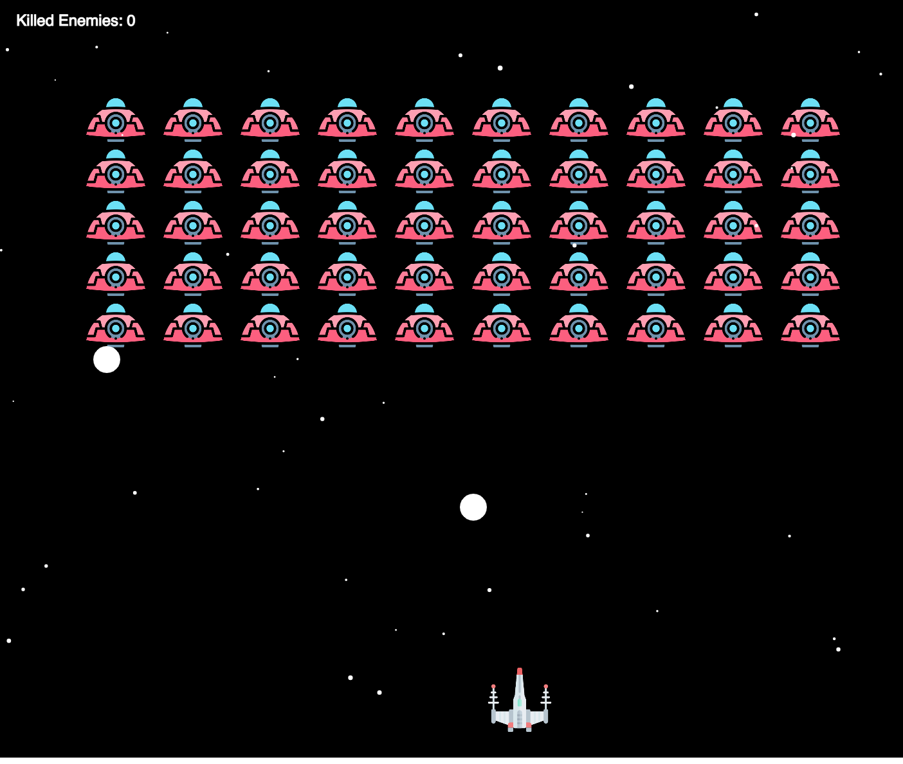

# space-invaders
Space Invaders is a classic arcade game where the player controls a spaceship and shoots down enemy aliens. This game is developed using the p5.js library and is open source.



## Installation
Use http-server or any other server to run the javascript game.

1. Use npm to install the server.
```
npm install -g http-server
```
2. Run the server.
```
cd directory/
http-server
```
3. Access the game through your web browser at: http://localhost:8080.

## Controls
- Use the arrow keys to move the spaceship left and right.
- Press the spacebar to shoot.

## Examples
The following website used the open-source code to build a custom space invaders:

- [Ahmadai Sapce Invaders](https://ahmadai.com/space/){:target="_blank"}

You can add your own game link to this section if you have used this code in your project.

## Contribution
The game icons from Flaticon free resources.

## License

   Copyright 2023 barqawiz

   Licensed under the Apache License, Version 2.0 (the "License");
   you may not use this file except in compliance with the License.
   You may obtain a copy of the License at

       http://www.apache.org/licenses/LICENSE-2.0

   Unless required by applicable law or agreed to in writing, software
   distributed under the License is distributed on an "AS IS" BASIS,
   WITHOUT WARRANTIES OR CONDITIONS OF ANY KIND, either express or implied.
   See the License for the specific language governing permissions and
   limitations under the License.
